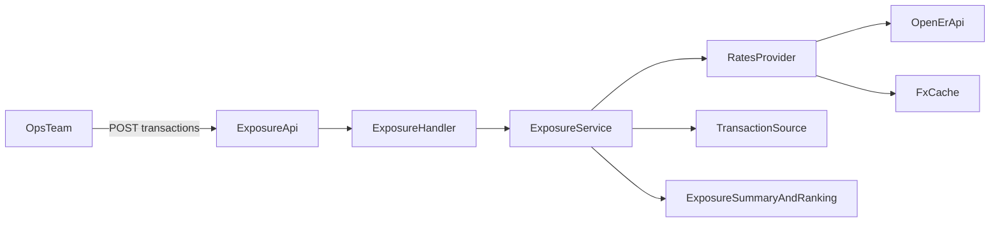

# Currency Hedge Calculator

Currency Hedge Calculator is a backend service that computes real-time FX exposure for authorized-but-not-captured payments and returns actionable risk rankings.

## Production Deployment

- Railway URL: [`https://currency-hedge-calculator-production.up.railway.app/`](https://currency-hedge-calculator-production.up.railway.app/)

## What This Service Does

- Accepts pending transactions through an API.
- Fetches live FX rates from `open.er-api.com`.
- Calculates, per transaction:
  - original settlement amount (auth-time rate)
  - current settlement amount (live rate)
  - exposure amount
  - exposure percentage
- Returns aggregate analytics:
  - total exposure
  - gain/loss/neutral counts
  - per-currency exposure breakdown
  - best/worst transactions
  - risk-prioritized ranking with `capture_now` / `monitor`

## Core Requirements Coverage

- This repo achieves **accurate exposure calculation** by computing original settlement value from authorization-time rates, current settlement value from live rates, per-transaction deltas, and full aggregate rollups (totals, gain/loss counts, currency breakdown, best/worst).
- This repo achieves **live FX integration with resilience** by querying external rate providers, retrying transient failures, applying quote freshness checks, handling unsupported pairs explicitly, resolving missing auth-time rates historically, and falling back to secondary/cached quotes when live calls fail.
- This repo achieves **actionable risk ranking** by sorting transactions by loss severity, flagging threshold breaches, and computing urgency/expiry/FX severity scores with pair-level trend insights for next-action guidance.

## API

- `GET /healthz`
- `POST /v1/exposure/calculate` (production endpoint)
- `POST /v1/exposure/calculate/test` (**demo-only endpoint**; loads analytics test data at call time)
- `GET /metrics`

OpenAPI contract: [`docs/openapi.yaml`](docs/openapi.yaml)

Example payloads:
- Request: [`docs/example-request.json`](docs/example-request.json)
- Response: [`docs/example-response.json`](docs/example-response.json)

## Local Run

```bash
cp .env.example .env
go mod tidy
make run-env
```

- App runs at `http://localhost:8080`.
- `make run-env` exports values from `.env` into runtime env vars before `go run .`.
- POST requests require `X-API-Key` and `X-Idempotency-Key` headers.

### Run Tests

```bash
go test ./...
```

## Docker Run

```bash
docker build -t currency-hedge-calculator:local .
docker run --rm -p 8080:8080 currency-hedge-calculator:local
```

or:

```bash
docker compose up --build
```

## Analytics Test Data

This repository includes API-callable datasets for both seeded demo validation and live-like load simulation.

- Seeded demo dataset (used by demo-only endpoint): [`data/analytics_test_transactions.json`](data/analytics_test_transactions.json)
- Postman live simulation payloads:
  - [`docs/postman/data/live_sample_50_request.json`](docs/postman/data/live_sample_50_request.json)
  - [`docs/postman/data/live_sample_100_request.json`](docs/postman/data/live_sample_100_request.json)
  - [`docs/postman/data/live_sample_1000_request.json`](docs/postman/data/live_sample_1000_request.json)
- Data diversity coverage:
  - timestamps spread across the prior month (up to 30 days old)
  - mixed currencies/country/provider/payment-method/status combinations
  - full + partial capture amounts to exercise capture-readiness paths

### Demo seeded test call

```bash
make analytics-local
```

Use a remote URL if needed:

```bash
API_URL=https://currency-hedge-calculator-production.up.railway.app make analytics-local
```

### Postman assets

- Collection: [`docs/postman/currency-hedge-calculator.postman_collection.json`](docs/postman/currency-hedge-calculator.postman_collection.json)
- Environment: [`docs/postman/currency-hedge-calculator.postman_environment.json`](docs/postman/currency-hedge-calculator.postman_environment.json)
- Includes all APIs with:
  - plain template requests for manual input
  - seeded demo requests
  - production live-simulation requests with 50/100/1000 transaction payloads

## API Usage

### Explicit request payload

```bash
curl --request POST \
  --url http://localhost:8080/v1/exposure/calculate \
  --header 'Content-Type: application/json' \
  --header 'X-API-Key: dev-api-key' \
  --header 'X-Idempotency-Key: 7bf41af5-70ae-4e79-9b28-a8fa75c3ac53' \
  --data @docs/example-request.json
```

### Empty payload behavior (production endpoint)

```bash
curl --request POST \
  --url http://localhost:8080/v1/exposure/calculate \
  --header 'Content-Type: application/json' \
  --header 'X-API-Key: dev-api-key' \
  --header 'X-Idempotency-Key: 7bf41af5-70ae-4e79-9b28-a8fa75c3ac53' \
  --data '{}'
```

Returns `400` with `NO_TRANSACTIONS`.

### Test endpoint (loads analytics dataset on call)

```bash
curl --request POST \
  --url http://localhost:8080/v1/exposure/calculate/test \
  --header 'Content-Type: application/json' \
  --header 'X-API-Key: dev-api-key' \
  --header 'X-Idempotency-Key: 7bf41af5-70ae-4e79-9b28-a8fa75c3ac53' \
  --data '{"risk_threshold_percentage":2}'
```

## Idempotency

- `X-Idempotency-Key` is required for every POST endpoint.
- Key format must be UUID.
- Same key + same payload returns cached response for 24 hours.
- Same key + different payload returns `409 IDEMPOTENCY_DUPLICATED`.
- Same key while initial request is still processing returns `409 REQUEST_IN_PROCESS`.

## FX Assumptions

- Current-rate settlement uses configurable assumptions: `FX_SETTLEMENT_SPREAD_BPS` + `FX_PROVIDER_MARKUP_BPS`.
- Quote freshness SLA is controlled by `FX_QUOTE_FRESHNESS_SLA`; older quotes are flagged as stale.
- Historical auth-rate lookup shifts weekend timestamps to the previous business day for realistic market data.
- Provider fallback order is: primary live source -> fallback provider latest quote -> stale cache.

## Architecture

This project follows Yuno-style API and code-structure conventions:

- `snake_case` payload fields
- consistent error envelope (`type`, `code`, `message`, `details`)
- interface-driven boundaries for testability
- non-business framework modules under `internal/framework`
- historical-rate fallback for missing `authorization_rate` values
- API hardening via auth, rate limiting, body/transaction limits, timeout budgets, and idempotency handling



## Deployment Artifacts

- Dockerfile: [`Dockerfile`](Dockerfile)
- Docker Compose: [`docker-compose.yml`](docker-compose.yml)
- Make targets: [`Makefile`](Makefile)
- Railway config: [`railway.toml`](railway.toml)
- CI workflow: [`.github/workflows/unit-tests.yml`](.github/workflows/unit-tests.yml)

Deployments to `main` are intended to be CI-gated (`go test ./...`) before Railway release.

## Trade-offs

- Idempotency and rate-limiting state are in-memory, so behavior is per instance.
- Metrics are lightweight JSON snapshots instead of full Prometheus instrumentation.
- FX fallback chain is practical but intentionally simple for operational clarity.

## What I'd Improve

- Move idempotency/rate-limit state to Redis for multi-instance consistency.
- Expose Prometheus metrics + dashboards for p95 latency and high-risk exposure totals.
- Add provider-native capture-capability matrix for richer capture-readiness decisions.
