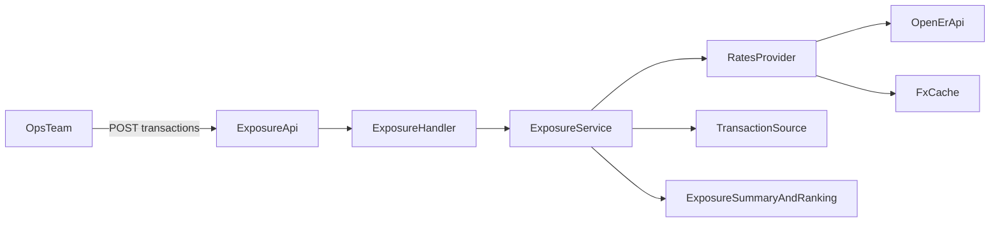

# Currency Hedge Calculator

Currency Hedge Calculator is a backend service that computes real-time FX exposure for authorized-but-not-captured payments and returns actionable risk rankings.

## Production Deployment

- Railway URL: [`https://currency-hedge-calculator-production.up.railway.app/`](https://currency-hedge-calculator-production.up.railway.app/)

## What This Service Does

- Accepts pending transactions through an API.
- Fetches live FX rates from `open.er-api.com`.
- Calculates, per transaction:
  - original settlement amount (auth-time rate)
  - current settlement amount (live rate)
  - exposure amount
  - exposure percentage
- Returns aggregate analytics:
  - total exposure
  - gain/loss/neutral counts
  - per-currency exposure breakdown
  - best/worst transactions
  - risk-prioritized ranking with `capture_now` / `monitor`

## API

- `GET /healthz`
- `POST /v1/exposure/calculate`

OpenAPI contract: [`docs/openapi.yaml`](docs/openapi.yaml)

Example payloads:
- Request: [`docs/example-request.json`](docs/example-request.json)
- Response: [`docs/example-response.json`](docs/example-response.json)

## Local Run

```bash
cp .env.example .env
go mod tidy
make run-env
```

- App runs at `http://localhost:8080`.
- `make run-env` exports values from `.env` into runtime env vars before `go run .`.

### Run Tests

```bash
go test ./...
```

## Docker Run

```bash
docker build -t currency-hedge-calculator:local .
docker run --rm -p 8080:8080 currency-hedge-calculator:local
```

or:

```bash
docker compose up --build
```

## Analytics Test Data

This repository includes API-callable test data for analytics and real-world style validation.

- Transaction dataset: [`data/analytics_test_transactions.json`](data/analytics_test_transactions.json)
- Run local analytics call:

```bash
make analytics-local
```

Use a remote URL if needed:

```bash
API_URL=https://currency-hedge-calculator-production.up.railway.app make analytics-local
```

## API Usage

### Explicit request payload

```bash
curl --request POST \
  --url http://localhost:8080/v1/exposure/calculate \
  --header 'Content-Type: application/json' \
  --header 'X-Idempotency-Key: 7bf41af5-70ae-4e79-9b28-a8fa75c3ac53' \
  --data @docs/example-request.json
```

### Default test-data fallback

```bash
curl --request POST \
  --url http://localhost:8080/v1/exposure/calculate \
  --header 'Content-Type: application/json' \
  --data '{}'
```

## Architecture

This project follows Yuno-style API and code-structure conventions:

- `snake_case` payload fields
- consistent error envelope (`type`, `code`, `message`, `details`)
- interface-driven boundaries for testability
- non-business framework modules under `internal/framework`



## Deployment Artifacts

- Dockerfile: [`Dockerfile`](Dockerfile)
- Docker Compose: [`docker-compose.yml`](docker-compose.yml)
- Make targets: [`Makefile`](Makefile)
- Railway config: [`railway.toml`](railway.toml)
- CI workflow: [`.github/workflows/unit-tests.yml`](.github/workflows/unit-tests.yml)

Deployments to `main` are intended to be CI-gated (`go test ./...`) before Railway release.
