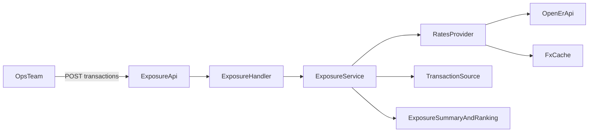

# Currency Hedge Calculator (Go)

Backend MVP for Nebula Travel's currency exposure challenge.  
It calculates real-time FX exposure for authorized-but-not-captured transactions, ranks risk, and helps payment ops decide what to capture first.

## What This Service Does

- Accepts pending transactions (auth-only, not captured).
- Fetches live FX rates from a public external API (`open.er-api.com`).
- Calculates per-transaction exposure:
  - original settlement value (at auth-time rate)
  - current settlement value (at current live rate)
  - exposure amount and exposure percentage
- Produces aggregate metrics:
  - total exposure
  - gain/loss counts
  - presentment-currency breakdown
  - best and worst transactions
- Generates an actionable ranking with a loss threshold (`capture_now` vs `monitor`).

## Domain Rate Convention

To match the challenge example, rates use **presentment-per-settlement** convention:

- `authorization_rate` = how many units of presentment currency equal 1 unit of settlement currency.
- Example: BRL/EUR = `6.0`.
- Settlement value formula: `settlement_value = authorized_amount / rate`.

## API Endpoints

- `GET /healthz`
- `POST /v1/exposure/calculate`

OpenAPI spec: [`docs/openapi.yaml`](docs/openapi.yaml)

Example payloads:
- Request: [`docs/example-request.json`](docs/example-request.json)
- Response: [`docs/example-response.json`](docs/example-response.json)

## Quick Start (Local)

### Prerequisites

- Go 1.24+
- Optional: Docker + Docker Compose

### Run locally

```bash
cp .env.example .env
go mod tidy
make run-env
```

Server starts at `http://localhost:8080`.

`make run-env` loads variables from `.env` and exports them into the process environment before `go run .`.

### Run tests

```bash
go test ./...
```

## Quick Start (Docker)

### Build and run image

```bash
docker build -t currency-hedge-calculator:local .
docker run --rm -p 8080:8080 currency-hedge-calculator:local
```

### Docker Compose

```bash
docker compose up --build
```

## API Usage

### 1) Calculate exposure with explicit transactions

```bash
curl --request POST \
  --url http://localhost:8080/v1/exposure/calculate \
  --header 'Content-Type: application/json' \
  --header 'X-Idempotency-Key: 7bf41af5-70ae-4e79-9b28-a8fa75c3ac53' \
  --data @docs/example-request.json
```

### 2) Use seeded data fallback (empty body)

```bash
curl --request POST \
  --url http://localhost:8080/v1/exposure/calculate \
  --header 'Content-Type: application/json' \
  --data '{}'
```

## Seed Data

- File: [`data/pending_transactions.json`](data/pending_transactions.json)
- Size: **50 transactions**
- Coverage:
  - BRL: 12
  - MXN: 12
  - COP: 12
  - ARS: 5
  - CLP: 4
  - EUR: 3
  - USD: 2
- Includes high-value and 25+ day old authorization cases.

## Architecture

This project follows Yuno-style principles for API consistency and maintainability:

- `snake_case` API fields
- consistent error envelope (`type`, `code`, `message`, `details`)
- interface-driven service boundaries for testability and pluggability
- non-business framework code under `internal/framework`

### Structure

```text
.
├── app.go
├── main.go
├── internal/
│   ├── config/
│   ├── framework/
│   │   ├── backoff/
│   │   ├── context/
│   │   ├── http_connector/
│   │   ├── logger/
│   │   ├── runner/
│   │   └── server/
│   └── service/
│       ├── exposure/
│       ├── rates/
│       └── transactions/
├── data/
├── docs/
└── .github/workflows/
```

### System Design and User Flow



## Quality and Reliability

- Unit tests:
  - exposure math and ranking
  - validation and handler behavior
  - FX retry and stale-cache fallback
- CI: GitHub Actions workflow at [`.github/workflows/unit-tests.yml`](.github/workflows/unit-tests.yml) runs `go test ./...` on PRs and pushes.

## Deployment Artifacts

- Dockerfile: [`Dockerfile`](Dockerfile)
- Docker Compose: [`docker-compose.yml`](docker-compose.yml)
- Make targets: [`Makefile`](Makefile)
- Railway config: [`railway.toml`](railway.toml)

Railway should deploy from `main` only after CI passes. The included workflow enforces test execution on PRs and pushes so merge-to-main can stay CI-gated.

### Deployment URL Placeholders

- Backend (Railway): `https://<railway-backend-url>`
- Frontend (Vercel): `N/A (backend-only challenge)`

## Trade-offs Made (2-hour Constraint)

- Used auth-time rate from payload/seed data instead of full historical FX retrieval per timestamp.
- Chose in-memory seed-backed transaction source over persistent DB.
- Implemented one high-value endpoint instead of multiple query/report endpoints.
- Kept risk model intentionally simple (`capture_now` when threshold crossed).

## Future Upgrades

- Persist transactions and exposure snapshots (PostgreSQL + Redis cache).
- Add historical-rate provider fallback and richer currency pair analytics.
- Add alerting/webhook stream for threshold breaches.
- Add auth, scopes, and stronger idempotency persistence.
- Add time-series exposure endpoint and hedging cost simulation.
